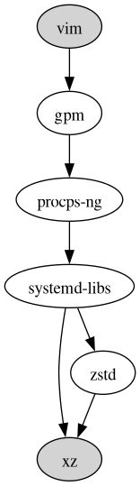

# pkgtrim - linux PacKaGe TRIMmer tool

pkgtrim is a helper tool to keep the number of installed packages small on Arch Linux and Ubuntu.
It's very easy to install a new package and then such packages linger forever making updates slower and the system bloated in general.
To fight back against that pkgtrim provides tooling to record the intent behind package installations and remove the unintended packages.

Caveat: requires lot of expertise to use this.
Removing the wrong package might break your system!

## Features

- With no arguments: lists all unintentionally installed top level packages and their size including the unique dependencies required only by the given top level package.
  Top level packages are the packages that no other packages depend on.
- With a list of packages: lists all shared dependencies, lists all unique dependencies, lists the top level reverse dependencies of the given package set.
- List the "intended packages" (packages meant to be installed) into ~/.pkgtrim.
  Use # comments to record why they are meant to be installed.
- Use `-remove` to remove all unintended or a selected list of packages and their unique dependencies.
  This is the trimming part.
- Use `-install` to install all intentional packages from ~/.pkgtrim.
  Useful for setting up a new machine.
- Use `-trace` to print the dependency graph between two nodes.
  Pipe it to `dot -Tx11` to visualize the graph.
- Use `-graph` to print all dependencies and reverse dependencies of a set of nodes in a graph form.
  Pipe it to `dot -Tx11` to visualize the graph.

Note that commands like `pacman -Qeq` (list explicitly installed packages) or `pacman -Qdtq` (list unneeded dependencies) already provide some of this functionality.
Similar commands exist for Ubuntu.
The big difference in pkgtrim is that the "explicitness" bit for a package is not stored in the package database but in a dotfile in the user's home directory.

## Examples

Here's my raspberry pi 4 with no arguments with an empty ~/.pkgtrim file:

```
$ pkgtrim
[... snipped because it's long ...]
   26.2 MB base                     Minimal package set to define a basic Arch Linux installation
   44.5 MB vim                      Vi Improved, a highly configurable, improved version of the vi text editor
   45.9 MB git                      the fast distributed version control system
   60.2 MB make                     GNU make utility to maintain groups of programs
   72.8 MB js-beautify              CSS, HTML & JavaScript unobfuscator and beautifier
   87.7 MB go-tools                 Developer tools for the Go programming language
  117.0 MB graphviz                 Graph visualization software
  231.5 MB go                       Core compiler tools for the Go programming language
  452.9 MB gnuplot                  Plotting package which outputs to X11, PostScript, PNG, GIF, and others
  493.0 MB clang                    C language family frontend for LLVM
  817.1 MB linux-aarch64            The Linux Kernel and modules - AArch64 multi-platform
```

Here's pkgtrim's output for `curl` with an empty ~/.pkgtrim file:

```
$ pkgtrim curl
shared dependencies (  337.8 MB): acl attr audit bash brotli ca-certificates-utils coreutils e2fsprogs filesystem findutils gcc-libs gdbm glibc gmp iana-etc keyutils krb5 libcap libcap-ng libevent libffi libgcrypt libgpg-error libidn2 libldap libnghttp2 libnghttp3 libnsl libp11-kit libpsl libsasl libtasn1 libtirpc libunistring libverto libxcrypt linux-api-headers lmdb lz4 ncurses openssl p11-kit pam pambase readline sqlite systemd-libs tzdata util-linux-libs xz zlib zstd

unique dependencies (    2.6 MB): curl libssh2

intentional top level rdeps:

unintentional top level rdeps: archlinuxarm-keyring base clang git gnuplot linux-aarch64 mutt perf
```

Here's my ~/.pkgtrim file on my raspberry pi 4:

```
$ cat ~/.pkgtrim
# base packages
archlinuxarm-keyring base ca-certificates linux-aarch64 *raspberrypi* uboot-tools
man-db man-pages openssh sudo
inetutils  # for hostname and telnet
net-tools  # for ifconfig
polkit     # allow administration as unprivileged user

# basic tools
moreutils mutt openbsd-netcat tmux vim wget which xclip xorg-xauth

# dev tools
go go-tools revive strace
clang git inotify-tools make perf fakeroot
js-beautify
graphviz gnuplot  # for the occasional graphing

# apps and build libs needed for my tools
alsa-lib libxss
pwgen
```

Here's a trace between two packages:

```
$ pkgtrim -trace vim xz
strict digraph {
  "gdb" [style=filled fillcolor=lightgray]
  "gmp" [style=filled fillcolor=lightgray]
  "vim" -> "gpm" -> "procps-ng" -> "systemd-libs" -> "xz"
  "vim" -> "gpm" -> "procps-ng" -> "systemd-libs" -> "zstd" -> "xz"
}
```

Here's the graphviz visualization of the above:

```
$ pkgtrim -trace vim xz | dot -Tx11
```



## Configuration

A .pkgtrim file should just list the packages that meant to be installed along with a comment.
The comment marker is #, everything is ignored after until the end of line, put comments there, see above example.

If a line begins with `!` pkgtrim interprets the rest of the line as a shell command to run and parses its standard output as if it was part of the .pkgtrim file.
Can be used to make the .pkgtrim file more flexible.
For example on some systems you might have a host specific .pkgtrim fragment.
You could load it from ~/.pkgtrim like this (the `|| true` is needed to not error out if the file doesn't exist):

```
base tmux zsh  # some packages shared on all machines
# optional hostname specific additions:
!cat ~/.pkgtrim.$HOSTNAME || true
```

## Installation

Available in AUR as pkgtrim, use something like `yay -Sy pkgtrim` to install it.

Alternatively install directly with Go.
Make sure `~/go/bin` (or whatever your `$GOPATH/bin` or `$GOBIN` is) is in your `$PATH` and then run:

```
go install github.com/ypsu/pkgtrim@latest
```

## Versioning

Uses [https://ypsu.github.io/featver](https://ypsu.github.io/featver) as its versioning scheme.
Stability for the stable features is guaranteed for 6 months once the tool reaches v1.

But currently it is v0 and stays v0 while I am the only user so no stability guarantee yet.

## Testing

pkgtrim uses [https://pkg.go.dev/github.com/ypsu/efftesting](https://pkg.go.dev/github.com/ypsu/efftesting) for the simple parts and [https://pkg.go.dev/github.com/ypsu/effdump](https://pkg.go.dev/github.com/ypsu/effdump) for the rest to ensure development convenience.
Testcases are in [https://pkg.go.dev/github.com/ypsu/textar](https://pkg.go.dev/github.com/ypsu/textar) format.
Make sure the `pre-commit` and the `post-commit` scripts are installed.
Run this to save at the baseline and then later see the effects of a change:

```
go run -tags=test github.com/ypsu/pkgtrim
```

## Contact

General discussion at [https://github.com/ypsu/pkgtrim/discussions](https://github.com/ypsu/pkgtrim/discussions).

File issues about specific problems at [https://github.com/ypsu/pkgtrim/issues](https://github.com/ypsu/pkgtrim/issues).
